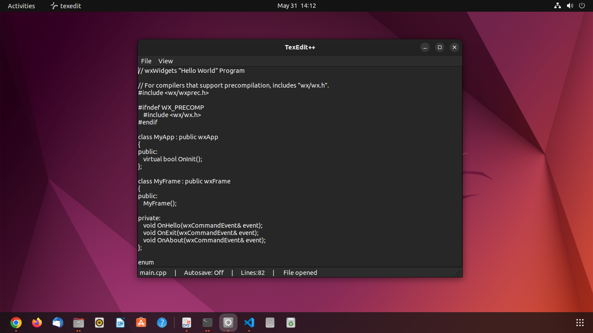

# 📝 TexEdit++

**TexEdit++** is a minimal, extensible, cross-platform C++ text editor built using the **wxWidgets** GUI library. It loads a text file passed via the command line, and provides helpful features like auto-saving, word counting, dark mode, and more — all with a lightweight codebase.

---

## 🚀 Features

* 📂 Open any text file via command line
* 💾 Save manually (`Ctrl+S`) or auto-save every 10 seconds (`Ctrl+U`)
* 🌙 Toggle dark/light mode (`Ctrl+D`)
* 🧹 Clear all text instantly (`Ctrl+L`)
* 📊 Displays real-time line count and save status in the status bar
* 🗃️ Creates the file if it doesn't exist
* ❓ Prompt to save or discard changes on exit

---

## 🖼️ Screenshot




---

## 🛠️ Requirements

* C++ compiler (`g++` or `clang++`)
* [wxWidgets](https://www.wxwidgets.org/) 3.x or newer

### 🐧 Install wxWidgets on Linux

```bash
sudo apt update
sudo apt install libwxgtk3.0-dev
```

---

## 🧑‍💻 Build & Run

### 🔧 1. Build and Install with Makefile

```bash
make
sudo make install
```
***Assuming you have setup $PATH to /usr/local/bin***
### ▶️ 2. Run with a file argument

```bash
texedit myfile.txt
```

If the file does not exist, it will be created automatically.

---

### Uninstalling
```bash
sudo make uninstall
```

## ⌨️ Keyboard Shortcuts

| Action           | Shortcut   |
| ---------------- | ---------- |
| Save             | `Ctrl + S` |
| Toggle Autosave  | `Ctrl + U` |
| Toggle Dark Mode | `Ctrl + D` |
| Clear All        | `Ctrl + L` |

---

## 📁 File Structure

```
.
├── src
|       main.cpp        # Main source code
├── Makefile            # Simple build script
|── README.md           # Project documentation
└── LICENSE             # OpenSource License
 
```

---

## 🔄 Status Bar Info

* Shows current file path
* Autosave status: `On` / `Off`
* Number of lines
* Save state: `Saved` / `Not Saved`

---

## 📌 Planned Features (Optional Ideas)

* File > Open / Save As dialog
* Font and theme customization
* Syntax highlighting (using wxStyledTextCtrl)
* Dirty-state asterisk in window title

---

## 📜 License

MIT License (or any other license of your choice)

---

<p style="text-align:center;">Made by Vijay Satheesh with Love 💌</p>
